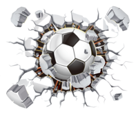

<!-- Logo/Banner do Projeto -->

  
  <h1 align="center">Cartola Lab</h1>
  

    Com o objetivo de deixar a competição mais emocionante, criamos competições próprias além das já existentes para o cartola.

	Nossa Liga é dividida em 5 competições:

	Liga Tradicional Cartola
	Liga Resta 1,
	Brasileirão,
	Copa do Brasil,
	Libertadores
  

  

	Essa API tem como objetivo, realizar os calculos das pontuações e obter os resutados dos confrontos 
  

 

<!-- Shields do Projeto -->

  
  
  

 

